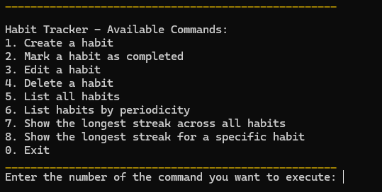
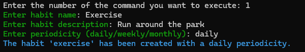
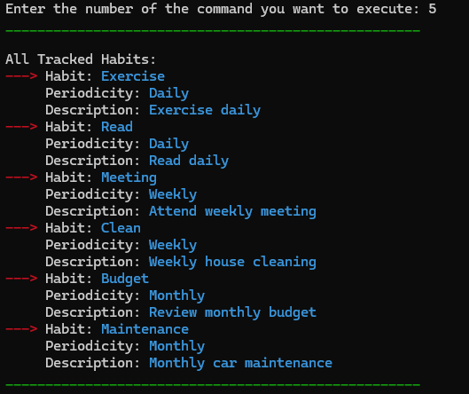
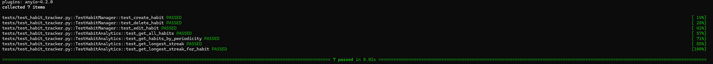

# Habit-Tracker-Web-App
**Course: Object-Oriented and Functional Programming with Python Task: Develop a backend for a Habit Tracking Application**

Objective: Design an app to allow users to track daily and weekly habits, establish streaks, and analyze their progress. The app will be developed using Python with an emphasis on object-oriented and functional programming.

## Table of Contents
- [Overview](#what-is-it)
- [Features](#features)
- [Getting Started](#getting-started)
- [Usage](#usage)
- [Testing](#testing)
- [Quality Assurance](#quality-assurance)

## Features
- **Habit Creation**: Users can create habits with specific tasks and intervals (e.g., daily, weekly).
- **Progress Tracking**: Users mark tasks as completed within each habit's interval. Missing a check-off results in a "broken" habit.
- **Streaks**: Consistently completing a habit builds a "streak" that reflects continuous progress across intervals.
- **Insights & Analytics**: Users track their longest streaks, view current habits, and list habits by periodicity.

## Getting started
To set up and launch this app, follow these steps:

### 1. Clone the Repository

To clone the repository, run the following command:

```shell
git clone https://github.com/MnOuSs/Habit-Tracker-Backend-App
```

### 2. Install Dependencies

Once you've cloned the repository to your machine, ensure all required dependencies are installed. If you have pip set up, run:

```shell
pip install -r requirements.txt
``` 
If you haven't installed pip yet, please refer to [this tutorial](https://python.land/virtual-environments/installing-packages-with-pip).

## Usage

The application is controlled through an interactive command-line interface (CLI). To start the app and explore available commands, use the following command:

```shell
python cli.py
``` 

The CLI user interface should look like this upon starting the app:



The user has to enter the number of the command to execute ranging form `1` to `8`, and `0` to exit the program.

After choosing the number of command to execute, the user will be prompted with what to do enter next, depending on the task associated.

Example of creating a habit by entering the number *1*:



The CLI was built in a way that it re-runs itself after finishing a certain task, until the user stops it by entering `0`  to exit.

It facilitates the interaction with the application, especially in the absence of a GUI.

## Testing

The app comes with no predefined habits as it expects the user to create and track their own habits. However, if you want to test the functionalities and the behavior of the application. It comes with a module that contains five predefined habits with their respective descriptions, periodicity and random generated completion dates from the last three months, needed for the calculation of their streaks.

Please run  the following command before running the program:

```shell
python predefined_habits_sideloader.py
```

Then proceed to run the program through:

```shell
python cli.py
```

You can check if the predefined habits are properly loaded into the database by choosing command number `5` from Habit Tracker App:

Note down that every time your run `predefined_habits_sideloader.py`, new completion dates are generated that allow new streaks to be be calculated. So have fun playing with that as well, testing the Habit Tracker App analytical functions.



## Quality Assurance

To test the core functions of the habit tracker app, you can run the following command:

```shell
python -m pytest tests/test_habit_tracker.py -v
```

### Example Test Output
Upon running the tests, you should see an output similar to this:

